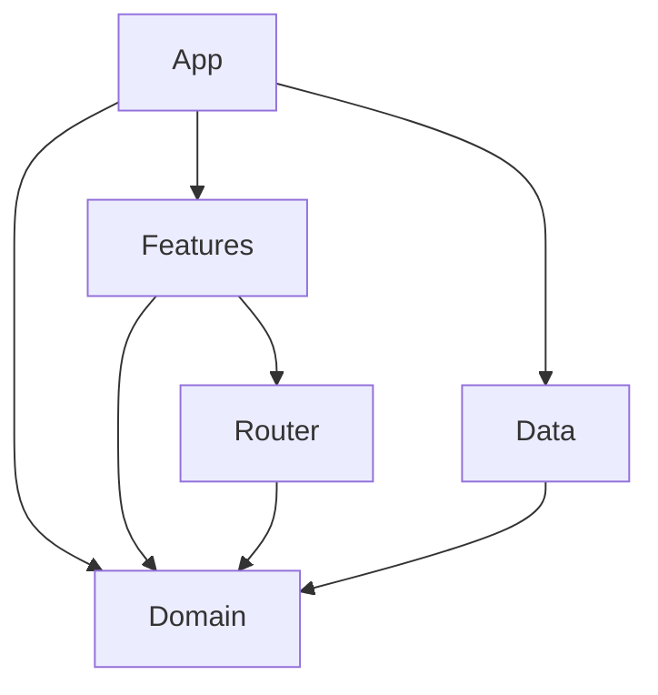

# MovieHub

MovieHub is a sample SwiftUI app that demonstrates a modular, testable architecture using SwiftPM packages, Swift Concurrency, and TMDb API v3.

## Features
- Search movies (TMDb)
- Movie details (poster, overview, genres)
- Favorites per user
- Lightweight auth (username only)
- Centralized navigation via Router
- Modular SwiftPM packages

## Architecture
This project is split into four layers: `Domain`, `Data`, `Features`, and `App`.
Three of them are SwiftPM packages to keep them cross‑platform and fast to build/test with `swift build` and `swift test`.
This is useful for fast iteration and for LLM‑driven changes where quick compilation matters.
In practice, `Features` can become iOS‑specific (SwiftUI or snapshot tests), and `Data` can also become iOS‑specific (SwiftData or third‑party SDKs).
The minimum goal is to keep `Domain` cross‑platform; for `Data` we can split iOS‑specific parts into a separate package if needed.

### Layer dependencies
- `Domain` has **no dependencies**.
- `Data` depends **only on Domain**.
- `Features` depends **only on Domain** and does **not** know about `Data`.
- `App` knows about all layers and composes them together.

### Layer responsibilities
**Domain**
- Business logic and data state (e.g., current user) not tied to UI
- Models, errors, utilities
- Protocols for data access
- Interactors (data state + `AsyncStream`)
- `DomainMocks` for previews/tests (kept here for convenience)

**Data**
- Implements Domain protocols
- Network and persistence (TMDb API + SwiftData)
- Owns DTOs and mapping
- No business logic; executes commands from Domain

**Features**
- UI modules + ViewModels (view state only: loading flags, errors, selections)
- Entry point is a `Builder` that receives dependencies and builds a screen
- Allows nested features and composition
- Contains a Router library that owns navigation state
- Features call router methods to request navigation

**App**
- Composition root (DI)
- Creates concrete implementations and wires Features
- Owns actual presentation (push/sheet) based on Router state

### Diagram


## Navigation
- Router owns per‑tab navigation stacks + sheet presentation.
- Features call `router.push(...)` for pushes and `router.present(...)` for sheets.
- App builds screens based on Router state.

## TMDb API Setup
This project uses The Movie Database (TMDb) API v3. The token must not be committed.

1) Create a TMDb account
2) Generate an **API Read Access Token**
3) Copy the example config:

```bash
cp Secrets.example.xcconfig Secrets.xcconfig
```

4) Put your token into `Secrets.xcconfig`:

```
TMDB_READ_TOKEN = YOUR_TMDB_READ_ACCESS_TOKEN_HERE
```

5) Build & run

`Secrets.xcconfig` is ignored by git.

## Testing
Run tests from the package folders:

```bash
cd Packages/Domain && swift test
cd ../Data && swift test
cd ../Features && swift test
```

## Notes
- Minimum platforms: iOS 17, macOS 15
- No Combine
- Data state lives in Domain Interactors
- View state lives in ViewModels
