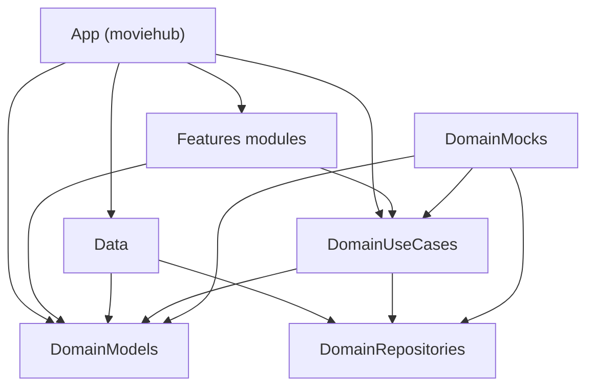

# MovieHub

MovieHub is a sample SwiftUI app that demonstrates a modular architecture with SwiftPM packages, Data Flows, and TMDb API v3.

## Features
- Movie search (TMDb)
- Movie details (poster, overview, genres)
- Per-user favorites lists
- Lightweight auth (username only)
- Router-based navigation (push + sheet)
- Modular feature libraries (`MovieList`, `MovieDetails`, `FavoriteList`, `FavoriteListDetails`, etc.)

## Architecture Overview
The project is split into four layers:
- `Domain` package (exports multiple products)
- `Data` package
- `Features` package
- `App` target (`moviehub`)

The key design goal is **strict dependency direction** and **LLM-friendly composition**:
- Features depend only on domain models/use-case APIs (closures), never on repository protocols or Data implementations.
- Data implements repository protocols and owns persistence/networking.
- App composes concrete repositories + use cases and injects closures into features.

## Domain Package Products (Important)
The SwiftPM package is named `Domain`, but it exports separate products/modules:
- `DomainModels`
- `DomainUseCases`
- `DomainRepositories`
- `DomainMocks`

### What each module contains
**`DomainModels`**
- Entities (`Movie`, `MovieDetails`, `FavoriteList`, `User`)
- ID wrappers (`MovieID`, `FavoriteListID`, `UserID`)
- Domain errors (`AuthRequiredError`)
- Pure domain helpers (`UsernameNormalizer`)

**`DomainUseCases`**
- Single-purpose use cases (one responsibility per file)
- Feature-facing closure aliases (`UseCaseClosureTypes.swift`) are the primary dependency API for Features, e.g.:
  - `LoginAction`
  - `CurrentUserReader`
  - `FavoriteListsSequenceSource`
  - `SearchMoviesAction`
  - `MovieDetailsAction`
- No use case protocols
- No `@Observable` use cases

**`DomainRepositories`**
- Repository protocols only (contracts)
- Includes repository-owned state + async sequence contracts
- Uses pure Swift Concurrency surface (`async/await`, `AsyncSequence`) and does not expose Combine types

**`DomainMocks`**
- Mocks used by previews/tests
- Includes repository mocks and lightweight use-case-style mocks

## Dependency Rules (Current)
### Cross-package rules
- `Features` imports **only** `DomainModels` and `DomainUseCases` from the Domain package
- `Features` may import `DomainMocks` only for preview/test helper code paths
- `Features` does **not** import `DomainRepositories`
- `Features` does **not** import `Data`
- `Data` imports `DomainModels` + `DomainRepositories`
- `App` imports `DomainModels`, `DomainUseCases`, `Data`, and feature modules

### Why this matters
This keeps Features independent from storage/network details and makes it easy to rewire dependencies in `AppContainer` using closures.

## Layer Responsibilities
**Domain (products in the Domain package)**
- Domain models, repository protocols, and business use cases
- Repository protocols define the state contracts and async sequences
- Use cases orchestrate business actions (auth checks, mutations, cross-repository flows)

**Data**
- Implements repository protocols using TMDb + SwiftData
- Owns DTOs and persistence mapping
- Owns repository state required by contracts (e.g. current user, lists caches, favorites caches)
- No business orchestration

**Features**
- SwiftUI feature libraries and ViewModels
- ViewModels own only view state (loading/error/selection/presentation state)
- Builders receive dependencies and construct screens
- Dependencies are closure-based (via `DomainUseCases` typealiases), not repository protocols
- Runtime observation uses async sequences injected from App composition

**App**
- Composition root / DI
- Creates concrete repositories and use cases
- Injects:
  - direct repository closures for simple state reads/streams
  - use-case closures for business actions
- Hosts Router navigation and screen presentation

## Current Architectural Patterns
### 1) Single-purpose use cases
Use cases are intentionally small and specific. Examples:
- `LoginUseCase`
- `LogoutUseCase`
- `RefreshFavoriteListsUseCase`
- `CreateFavoriteListUseCase`
- `AddFavoriteUseCase`
- `LookupFavoriteListUseCase`

### 2) Closure-based feature dependencies (no UseCase protocols)
Features receive closures instead of `*UseCaseProtocol` types.

Example pattern:
```swift
public typealias FavoriteListsReader = @MainActor () -> [FavoriteList]
public typealias RefreshFavoriteListsAction = @MainActor () async throws -> Void
```

This keeps feature dependencies explicit and lightweight.

In practice, the closure `typealias`es in `DomainUseCases/UseCaseClosureTypes.swift` are the stable, feature-facing API shape for dependency injection.

### 3) Repository-owned state + async sequences
Local state previously held in interactors now lives in repositories.
Repository protocols expose both current values and streams, for example:
- `currentUser` + `currentUserSequence`
- `lists` + `listsSequence`
- `favoritesByList` + `favoritesByListSequence`
- `favoriteListByMovie` + `favoriteListByMovieSequence`

### 4) Async sequence observation in ViewModels
`Utilities` package was removed. Runtime observation now uses injected async sequences:
- ViewModel starts `Task`
- `for await` over injected sequence source
- updates local view state
- cancels tasks in `deinit`

### 4.1) Combine in Data, Swift Concurrency in Domain/Features (bridge pattern)
This project intentionally keeps **Combine** as an implementation detail of the **Data** layer while exposing **pure Swift Concurrency APIs** to the rest of the app.

- Domain repository protocols expose:
  - current state values
  - `AsyncSequence` streams
- Features consume only async sequences (`for await`) and closures
- Data repositories may internally use `CurrentValueSubject` (Combine) to publish state changes
- Data repositories bridge to Domain contracts using `subject.values` to return an `AsyncSequence`

This gives ergonomic mutable stream handling in Data without leaking Combine into Domain or Features.

### 5) Simple state passthroughs are injected directly from repositories
Some former “read-only use cases” were removed (e.g. current user/list state wrappers).
App composition injects direct closures instead, e.g.:
```swift
currentUserUseCase: { container.profileRepository.currentUser }
currentUserSequenceUseCase: { container.profileRepository.currentUserSequence }
```

Use cases remain for behavioral logic, validation, and mutations.

## Navigation
- Router owns per-tab `NavigationStack` paths and sheet presentation.
- Features emit navigation intents through `router.push(...)` / `router.present(...)`.
- App renders destinations based on Router state.

## Package/Module Diagram

```mermaid
graph TD
    App["App (moviehub)"]
    Data["Data"]
    Features["Features modules"]
    DM["DomainModels"]
    DU["DomainUseCases"]
    DR["DomainRepositories"]
    DMocks["DomainMocks"]

    App --> Data
    App --> Features
    App --> DM
    App --> DU

    Features --> DM
    Features --> DU

    Data --> DM
    Data --> DR

    DU --> DM
    DU --> DR

    DMocks --> DM
    DMocks --> DU
    DMocks --> DR
```

## TMDb API Setup
This project uses The Movie Database (TMDb) API v3. The token must not be committed.

1. Create a TMDb account
2. Generate an **API Read Access Token**
3. Copy the example config:

```bash
cp Secrets.example.xcconfig Secrets.xcconfig
```

4. Put your token into `Secrets.xcconfig`:

```xcconfig
TMDB_READ_TOKEN = YOUR_TMDB_READ_ACCESS_TOKEN_HERE
```

5. Build & run

`Secrets.xcconfig` is ignored by git.

## Testing
Run tests from package folders:

```bash
cd Packages/Domain && swift test
cd ../Data && swift test
cd ../Features && swift test
```

ViewModel tests use the direct async method pattern via `@testable import`:

```swift
await viewModel.login()
#expect(viewModel.state == .success)
```

No polling or observation helpers are needed.

## Notes
- Minimum platforms: iOS 18, macOS 15
- Avoid introducing `Data` or `DomainRepositories` imports into Features
- Avoid introducing grouped/facade use cases or `*UseCaseProtocol` abstractions
- Keep Combine confined to Data/Mocks implementation details; Domain/Features APIs remain Swift Concurrency-first
